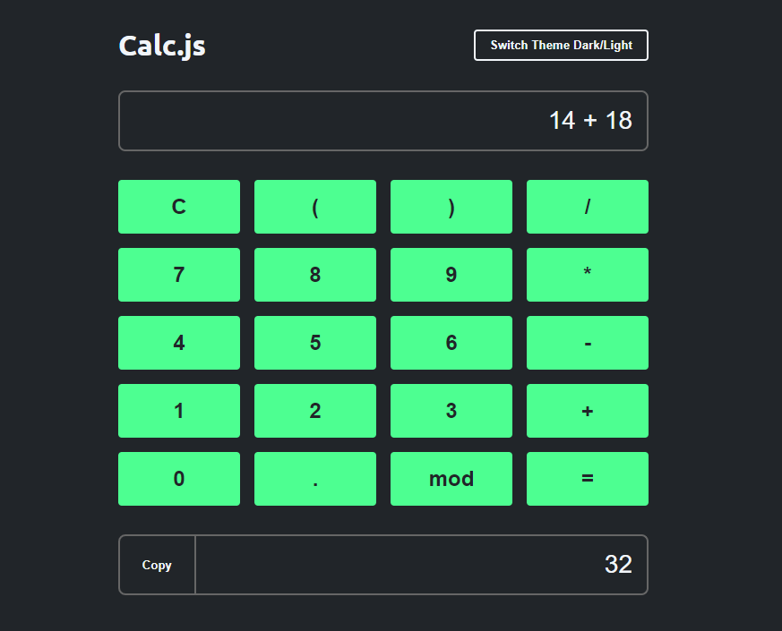
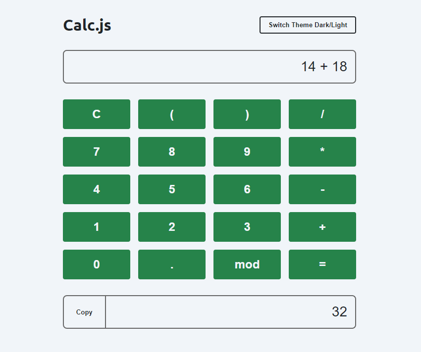

# Calculadora

# Sobre o projeto
A aplicação Calculadora permite que os usuários realizem operações matemáticas básicas (adição, subtração, multiplicação, divisão) em uma interface limpa e intuitiva. Além das funcionalidades padrão de uma calculadora, a aplicação oferece a opção de alternar entre temas claro e escuro para uma melhor experiência visual e permite que os usuários copiem o resultado da operação para a área de transferência.

# Layout




# Como executar o projeto

```
# Clonar repositório
git clone https://github.com/miguelfelipe09/calculator.git

# Executar o projeto
Vá até a pasta do projeto e abra o executável "calc.html"
```

# Autor

Miguel Felipe da Silva

https://www.linkedin.com/in/miguel-felipe-aab18523a/
